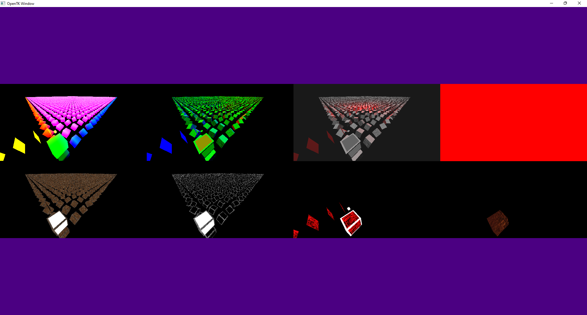

# Welcome to our simple OpenTK Render

This small renderer is based on the openGL/openTK tutorials, plus individual refacoring. 
> **Note** The renderer uses OpenGL 4.1 - for MacOS compatibility. 

## Why

- We couldn't find a standalone renderer in c#.
- Unity and UE is more than we need for our application.

## Current state:

- Runs on Apple M1
- Runs on Windows
- Runs on Linux / Steam Deck

# Goal:
- "Simple" C# renderer with Deferred Rendering
